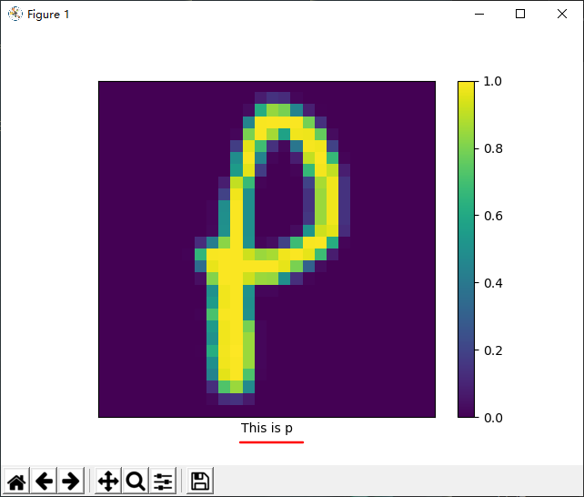

# LeNet5 Based On Keras
(based on tensorflow-gpu 2.1.0)
## Structure

**LeNet5 Structure**

**CNN Model Structure**

activators: tanh

## Data

EMNIST Letters: 145,600 characters. 26 balanced classes.

from [US National Institute of Standards and Technology](https://www.nist.gov/itl/products-and-services/emnist-dataset)

> ## The EMNIST Dataset
> ### What is it?
> The EMNIST dataset is a set of handwritten character digits derived from the
> [NIST Special Database 19](https://www.nist.gov/srd/nist-special-database-19) and converted to a 28x28 pixel image 
> format and dataset structure that directly matches the [MNIST dataset](http://yann.lecun.com/exdb/mnist/).
> Further information on the dataset contents and conversion process can be found in the paper available at 
> https://arxiv.org/abs/1702.05373v1
> ### Formats
> The dataset is provided in two file formats. Both versions of the dataset contain identical information, 
> and are provided entirely for the sake of convenience. The first dataset is provided in a Matlab format 
> that is accessible through both Matlab and Python (using the scipy.io.loadmat function). 
> The second version of the dataset is provided in the same binary format as the original MNIST dataset as 
> outlined in http://yann.lecun.com/exdb/mnist/
> ### Dataset Summary
> - EMNIST ByClass: 814,255 characters. 62 unbalanced classes.
> - EMNIST ByMerge: 814,255 characters. 47 unbalanced classes.
> - EMNIST Balanced:  131,600 characters. 47 balanced classes.
> - EMNIST Letters: 145,600 characters. 26 balanced classes.
> - EMNIST Digits: 280,000 characters. 10 balanced classes.
> - EMNIST MNIST: 70,000 characters. 10 balanced classes.
> 
> ...
> 
> ### Where to download
> - [Readme.txt file](http://www.itl.nist.gov/iaui/vip/cs_links/EMNIST/Readme.txt)
> - Binary format as the [original MNIST dataset](http://www.itl.nist.gov/iaui/vip/cs_links/EMNIST/gzip.zip)
> - [Matlab format dataset](http://www.itl.nist.gov/iaui/vip/cs_links/EMNIST/matlab.zip)
> - EMNIST paper, available at: https://arxiv.org/abs/1702.05373v1

## Running

model training

model structure output

training

## Validate
### train images recognize test

recognizing correct

### real handwriting character test
***example 1*** bold A

photograph

read in python and transform into 28*28

three channels into one channel

recognize result

correct!

***example 2*** normal q

photograph

read in python and transform into 28*28

three channels into one channel

recognize result

correct!